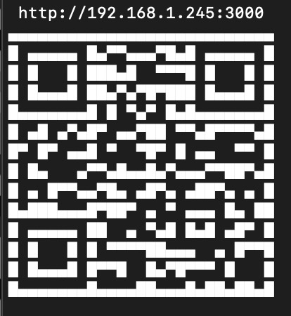

# qls — QR Link Server

Generate a QR code that opens your local dev server from another device on your LAN.

## Install

### Global (preferred for quick usage):

`npm i -g qls` then `qls 3000`

### No install (one‑off use):

`npx qls 3000`

### Local dev (from this repo):

`npm link` then `qls 3000`

## Usage

```
qls <port>

Example: qls 3000
```



qls waits until the given port is reachable on localhost, rewrites the host to your LAN IP, prints a QR in the terminal, and echoes the URL.

## Why

Open your local dev server on a phone/tablet without typing IPs. Great for testing responsive layouts, PWAs, and camera features.

## Notes

Requires Node.js (LTS recommended). Works on macOS, Linux, and Windows.

The QR encodes `http://<your-lan-ip>:<port>` - ensure your device is on the same Wi‑Fi/LAN and your firewall allows access.

## Troubleshooting

Can’t find LAN IP: some environments (e.g., containers) may restrict network interfaces. Run on your host OS or expose interfaces.

Port never becomes ready: ensure your dev server is running on the given port and listening on localhost.

## Alternatives / Name ideas

Other nice names we considered (wanted something short and memorable): `qres`, `lan-qr`, `dev-qr`, `qr-dev-link`, `qrserve`, `qr-open`, `port2qr`

## License

MIT License

Copyright (c) 2025 tsourdox

Permission is hereby granted, free of charge, to any person obtaining a copy
of this software and associated documentation files (the "Software"), to deal
in the Software without restriction, including without limitation the rights
to use, copy, modify, merge, publish, distribute, sublicense, and/or sell
copies of the Software, and to permit persons to whom the Software is
furnished to do so, subject to the following conditions:

The above copyright notice and this permission notice shall be included in all
copies or substantial portions of the Software.

THE SOFTWARE IS PROVIDED "AS IS", WITHOUT WARRANTY OF ANY KIND, EXPRESS OR
IMPLIED, INCLUDING BUT NOT LIMITED TO THE WARRANTIES OF MERCHANTABILITY,
FITNESS FOR A PARTICULAR PURPOSE AND NONINFRINGEMENT. IN NO EVENT SHALL THE
AUTHORS OR COPYRIGHT HOLDERS BE LIABLE FOR ANY CLAIM, DAMAGES OR OTHER
LIABILITY, WHETHER IN AN ACTION OF CONTRACT, TORT OR OTHERWISE, ARISING FROM,
OUT OF OR IN CONNECTION WITH THE SOFTWARE OR THE USE OR OTHER DEALINGS IN THE
SOFTWARE.

See `LICENSE` for the authoritative text.
